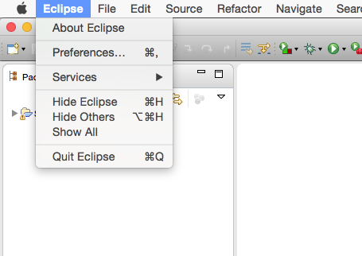
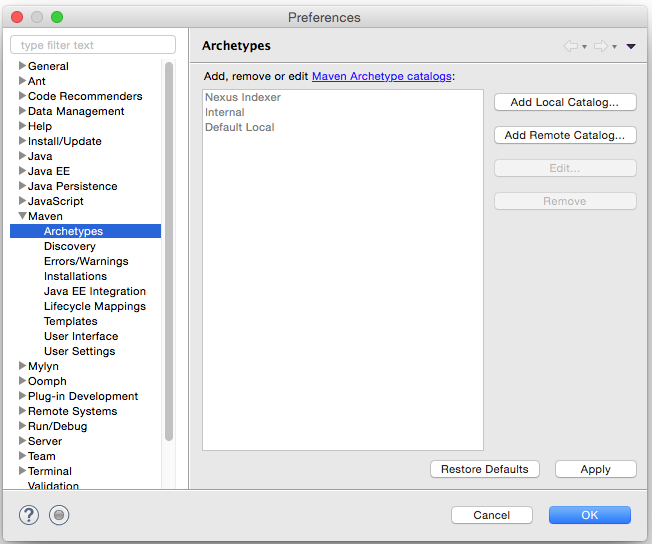
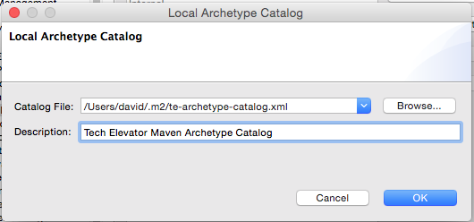
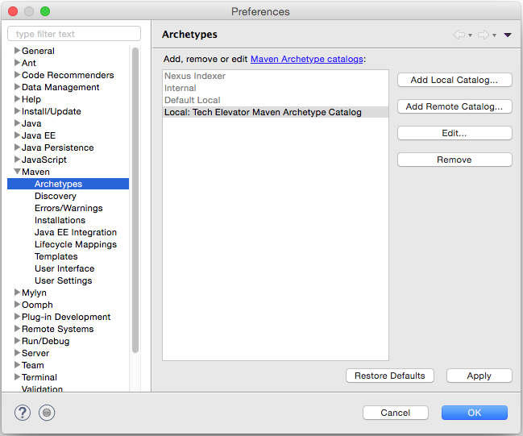
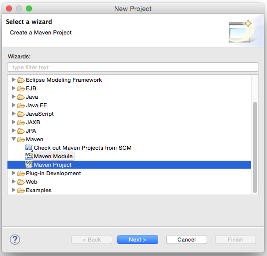
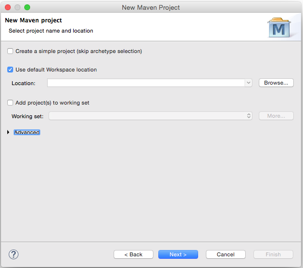
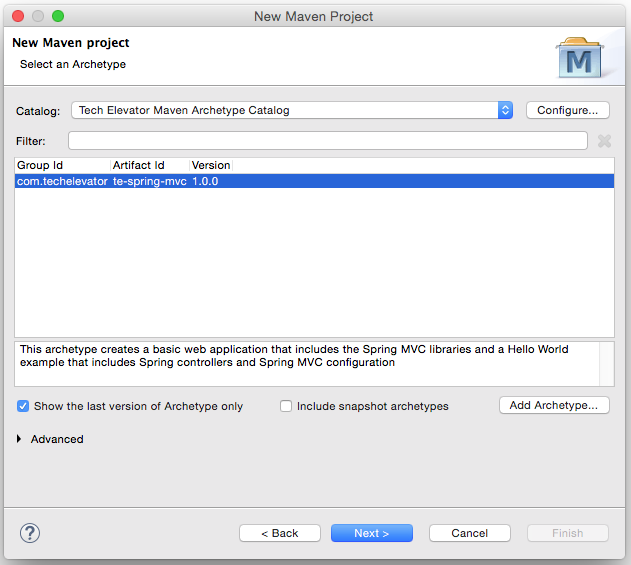
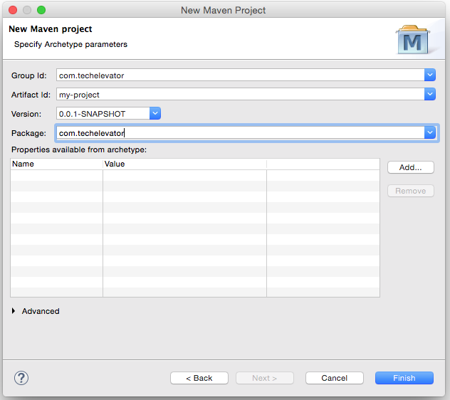

#Tech Elevator Maven Archetypes

The following archetypes are available in this repository:

| archetype name | description |
| -------------- | ----------- |
| te-basic       | This archetype creates a standard Maven directory structure populated with placeholder files |
| te-web         | Coming soon... |
| te-spring-mvc  | This archetype creates a basic web application that includes the Spring MVC libraries and a Hello World example that includes Spring controllers and Spring MVC configuration |

## Installing an archetype

### Installing into the local Maven repository
Before you can use one of these archetypes to create a project, you must install it into your local Maven repository.  These instructions assume you already have Maven installed on your local machine.

1. Clone this reposistory onto your local machine using `git clone`

2. From a shell session, change your working directory to the root directory of the Maven archetype you want to install.  (There will be a `pom.xml` file inside this directory.)

3. Execute `mvn install`

4. If you see `BUILD SUCCESS`, then the archetype has been installed successfully

### Adding the archetype to Eclipse

1. Copy the `te-archetype-catalog.xml` file into the `~/.m2/` directory.

2. Start Eclipse

3. Open `Eclipse > Preferences` from the menu bar
	
	

4. Choose `Maven > Archetypes` from the Preferences dialog

	

5. Click `Add Local Catalog...`

6. Enter the path (or use `Browse...`) to the `te-archetype-catalog.xml` file we moved into `~/.m2/` earlier into the `Catalog File` field.

7. Enter "Tech Elevator Maven Archetype Catalog" as the value for the `Description` field

	
	
8. Click `OK`

9. You should now see the new catalog in the list of catalogs

	

10. Click `OK`

### Creating a new Eclipse project from a Maven archetype

1. Open `File > New > Project...` from the menu bar

	

2. Choose `Maven > Maven Project`

	

3. Click `Next >`

4. Accept the defaults in the "New Maven Project" dialog and click `Next >`

	

5. From the `Catalog` select box choose "Tech Elevator Maven Archetype Catalog" and then click on the archetype you want to use to create a new Eclipse project.

	
	
6. Click `Next >`

7. Enter "com.techelvator" into the `Group Id` field

8. Enter the name you want to use for your project into the `Artifact Id` field

9. Modify the value in the `Package` field to be the base package name you want to use (i.e. "com.techelevator")

	

10. Click `Finish`

